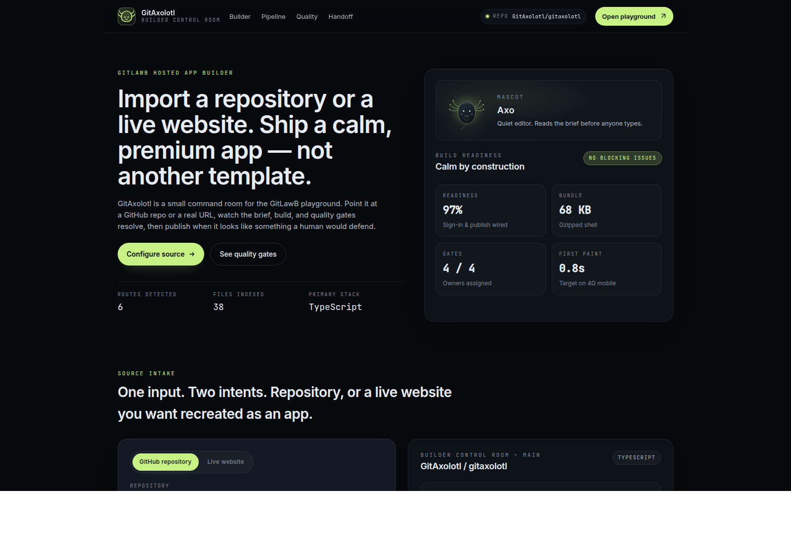
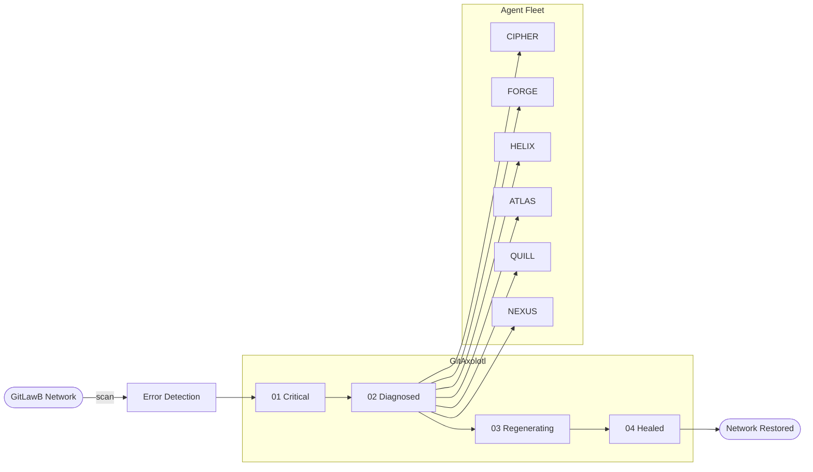

# GitAxolotl


> Network error detection & regeneration dashboard for the GitLawB decentralized agent network.



## How it works



## Features

- **Healing Pipeline** — 4-stage visualization: Critical → Diagnosed → Regenerating → Healed
- **18 Error Cards** — severity pills, file paths, agent assignments, progress bars, expandable descriptions
- **Agent Health Grid** — 6 agents with SVG ring charts, specialty tags, success rates
- **Regeneration Log** — terminal-style streaming feed, new entries every 3.5s
- **Axolotl Mascot** — line-art cursor follower with smooth lerp, tail wave, breathing animation
- **Monochrome Design** — black/white/glassmorphism, custom cursor, stagger animations
- **Keyboard Shortcuts** — `1`-`4` filter by stage, `0` clears, `Escape` collapses
- **Mobile Responsive** — stacks to 2-column grid, hides mascot on small screens

## Getting started

```bash
git clone https://github.com/GitAxolotl/gitaxolotl.git
cd gitaxolotl
npm install
npm run dev
```

## Tech

- Vite + React 19 + TypeScript 6
- Single-file architecture: `src/App.tsx` + `src/index.css`
- Zero runtime dependencies beyond React
- Canvas-based axolotl cursor follower

## License

MIT
